# SampahBijak 🌱♻️

## Deskripsi Aplikasi

**SampahBijak** adalah platform berbasis web yang dirancang untuk mendorong pemilahan dan daur ulang sampah rumah tangga dengan cara yang menyenangkan melalui sistem gamifikasi. Pengguna dapat menukar sampah yang sudah dipilah menjadi poin, yang kemudian dapat ditukarkan dengan berbagai hadiah menarik.

Tujuan utama aplikasi ini adalah meningkatkan kesadaran lingkungan masyarakat sambil memberikan insentif nyata untuk kebiasaan daur ulang yang berkelanjutan.

---

## 🎯 Fitur Utama

### 1. **Peta Dropbox (Map)**
- Menampilkan lokasi titik pengumpulan sampah terdekat menggunakan peta interaktif
- Informasi jadwal pengambilan sampah
- Navigasi ke lokasi dropbox

### 2. **Kalkulator Penukaran (Exchange)**
- Menghitung estimasi poin berdasarkan jenis dan berat sampah
- 6 jenis sampah yang dapat ditukar:
  - Plastik: 100 poin/kg
  - Kertas: 80 poin/kg
  - Logam: 150 poin/kg
  - Kaca: 120 poin/kg
  - Elektronik: 200 poin/kg
  - Organik: 50 poin/kg
- Input lokasi pengambilan dan catatan tambahan
- Pengiriman permintaan penukaran ke sistem

### 3. **Riwayat Transaksi (History)**
- Melacak semua transaksi penukaran sampah
- Melihat status transaksi (Pending, Approved, Rejected)
- Detail setiap transaksi lengkap dengan poin yang diperoleh

### 4. **Papan Peringkat (Leaderboard)**
- Menampilkan ranking pengguna paling aktif
- Sistem reward berdasarkan total poin
- Motivasi untuk lebih aktif dalam daur ulang

### 5. **Pusat Edukasi (Education)**
- Video pembelajaran tentang daur ulang
- Tips dan trik pemilahan sampah
- Kuis interaktif untuk menguji pengetahuan

### 6. **QR Code**
- Generate QR code pribadi untuk verifikasi identitas
- Download QR code untuk keperluan transaksi
- Scan QR code (untuk admin)

### 7. **Panel Admin**
- Scan QR code pengguna untuk verifikasi
- Kelola transaksi (approve/reject)
- Monitor aktivitas pengguna

### 8. **Profil Pengguna (Profile)**
- Informasi pribadi pengguna
- Total poin yang dimiliki
- Statistik aktivitas

---

## 🔄 Alur Kerja Aplikasi

### **A. Alur Pengguna Umum**

1. **Registrasi/Login**
   - Pengguna membuat akun baru atau login dengan akun yang sudah ada
   - Data disimpan di Local Storage

2. **Akses Dashboard**
   - Melihat total poin, statistik, dan fitur yang tersedia
   - Memilih fitur yang ingin digunakan

3. **Mencari Dropbox**
   - Membuka peta untuk menemukan lokasi dropbox terdekat
   - Melihat informasi jadwal dan alamat

4. **Menukar Sampah**
   - Memilih jenis sampah yang akan ditukar
   - Memasukkan berat sampah (kg)
   - Memasukkan lokasi pengambilan
   - Kalkulator otomatis menghitung estimasi poin
   - Mengirim permintaan penukaran

5. **Menunggu Konfirmasi**
   - Transaksi berstatus "Pending"
   - Admin akan melakukan verifikasi

6. **Poin Masuk**
   - Setelah admin approve, poin otomatis ditambahkan ke akun
   - Pengguna dapat melihat poin di profil dan riwayat

7. **Edukasi**
   - Belajar tentang cara daur ulang yang benar
   - Mengikuti kuis untuk menambah wawasan

### **B. Alur Admin**

1. **Akses Panel Admin**
   - Admin membuka halaman `/admin`
   - Tidak memerlukan login (akses langsung)

2. **Scan QR Code**
   - Admin scan QR code pengguna untuk verifikasi identitas
   - Mendapatkan informasi pengguna

3. **Kelola Transaksi**
   - Melihat daftar transaksi pending
   - Verifikasi sampah yang diserahkan
   - Approve atau reject transaksi
   - Jika approve, poin otomatis ditambahkan ke akun pengguna

---

## 📊 Flowchart Aplikasi

### 1. Flowchart Alur Utama


### 2. Flowchart Alur Admin


### 3. Flowchart Sistem Poin

```mermaid
flowchart TD
    StartPoint([Mulai Perhitungan Poin]) --> GetType[Dapatkan Jenis Sampah]
    GetType --> GetWeight[Dapatkan Berat kg]
    
    GetWeight --> CalcFormula[Poin = Berat × Rate]
    
    CalcFormula --> CheckType{Jenis Sampah?}
    
    CheckType -->|Plastik| Rate1[Rate = 100 poin/kg]
    CheckType -->|Kertas| Rate2[Rate = 80 poin/kg]
    CheckType -->|Logam| Rate3[Rate = 150 poin/kg]
    CheckType -->|Kaca| Rate4[Rate = 120 poin/kg]
    CheckType -->|Elektronik| Rate5[Rate = 200 poin/kg]
    CheckType -->|Organik| Rate6[Rate = 50 poin/kg]
    
    Rate1 --> Calculate[Hitung Total Poin]
    Rate2 --> Calculate
    Rate3 --> Calculate
    Rate4 --> Calculate
    Rate5 --> Calculate
    Rate6 --> Calculate
    
    Calculate --> DisplayPoints[Tampilkan Estimasi Poin]
    DisplayPoints --> EndPoint([Selesai])
```



### 4. Flowchart Status Transaksi


---

## 🛠️ Teknologi yang Digunakan

### Frontend
- **React 18.2.0** - Library JavaScript untuk membangun UI
- **React Router DOM 6.20.0** - Routing dan navigasi
- **Vite 5.0.7** - Build tool dan development server
- **Tailwind CSS 3.3.6** - CSS framework untuk styling

### Libraries & Dependencies
- **Lucide React** - Icon library
- **React Leaflet** - Peta interaktif
- **Leaflet** - Library maps
- **QRCode.react** - Generate QR code
- **html5-qrcode** - Scan QR code

### Storage
- **Local Storage** - Penyimpanan data pengguna, transaksi, dan poin

---

## 📦 Instalasi dan Menjalankan Aplikasi

### Prasyarat
- Node.js (versi 16 atau lebih tinggi)
- npm atau yarn

### Langkah Instalasi

1. **Clone Repository**
   ```bash
   git clone <repository-url>
   cd sampahbijak
   ```

2. **Install Dependencies**
   ```bash
   npm install
   ```

3. **Jalankan Development Server**
   ```bash
   npm run dev
   ```
   Aplikasi akan berjalan di `http://0.0.0.0:5000`

4. **Build untuk Production**
   ```bash
   npm run build
   ```

5. **Preview Build**
   ```bash
   npm run preview
   ```

---

## 📱 Cara Penggunaan

### Untuk Pengguna

1. **Buka aplikasi** di browser
2. **Daftar** dengan email dan password (atau login jika sudah punya akun)
3. Di **Dashboard**, lihat total poin dan pilih fitur:
   - **Peta Dropbox**: Cari lokasi dropbox terdekat
   - **Tukar Sampah**: Kirim sampah untuk ditukar poin
   - **Riwayat**: Lihat transaksi kamu
   - **Leaderboard**: Lihat ranking pengguna
   - **Edukasi**: Belajar tentang daur ulang
   - **QR Code**: Generate QR untuk verifikasi
4. Untuk **menukar sampah**:
   - Pilih jenis sampah
   - Input berat (kg)
   - Input lokasi pengambilan
   - Klik "Hitung Estimasi"
   - Klik "Kirim Sampah Sekarang"
5. **Tunggu konfirmasi** dari admin
6. Poin akan masuk setelah admin approve

### Untuk Admin

1. **Buka panel admin** di `/admin`
2. **Scan QR code** pengguna untuk verifikasi
3. **Lihat transaksi pending** di tabel
4. **Verifikasi sampah** yang diserahkan pengguna
5. **Approve atau Reject** transaksi
6. Poin otomatis ditambahkan jika di-approve

---

## 📂 Struktur Project

```
sampahbijak/
├── src/
│   ├── components/
│   │   └── Layout.jsx          # Layout utama dengan navbar
│   ├── pages/
│   │   ├── Home.jsx             # Dashboard utama
│   │   ├── Auth.jsx             # Login/Register
│   │   ├── Map.jsx              # Peta dropbox
│   │   ├── Exchange.jsx         # Tukar sampah
│   │   ├── History.jsx          # Riwayat transaksi
│   │   ├── Leaderboard.jsx      # Papan peringkat
│   │   ├── Education.jsx        # Pusat edukasi
│   │   ├── MyQRCode.jsx         # QR code pengguna
│   │   ├── Profile.jsx          # Profil pengguna
│   │   └── Admin.jsx            # Panel admin
│   ├── App.jsx                  # Router utama
│   ├── main.jsx                 # Entry point
│   └── index.css                # Global styles
├── public/                      # Assets statis
├── package.json                 # Dependencies
├── vite.config.js              # Konfigurasi Vite
├── tailwind.config.js          # Konfigurasi Tailwind
└── README.md                    # Dokumentasi ini
```

---

## 💾 Data Storage (Local Storage)

Aplikasi menggunakan Local Storage untuk menyimpan data:

### 1. **Users** (`users`)
```json
[
  {
    "id": "unique-id",
    "name": "Nama User",
    "email": "email@example.com",
    "password": "hashed-password",
    "phone": "08123456789",
    "points": 0,
    "createdAt": "2024-01-01T00:00:00.000Z"
  }
]
```

### 2. **Current User** (`currentUser`)
```json
{
  "id": "unique-id",
  "name": "Nama User",
  "email": "email@example.com",
  "points": 1500
}
```

### 3. **Transactions** (`transactions`)
```json
[
  {
    "id": "transaction-id",
    "userId": "user-id",
    "userName": "Nama User",
    "userEmail": "email@example.com",
    "wasteType": "Plastik",
    "weight": 5.5,
    "points": 550,
    "location": "Jl. Contoh No. 10",
    "notes": "Catatan tambahan",
    "date": "2024-01-01T10:00:00.000Z",
    "status": "pending|approved|rejected"
  }
]
```

### 4. **Login Status** (`isLoggedIn`)
```
"true" atau "false"
```

---

## 🎨 Fitur UI/UX

- **Responsive Design** - Bekerja di desktop, tablet, dan mobile
- **Modern Interface** - Desain modern dengan gradien dan animasi
- **Intuitive Navigation** - Bottom navigation untuk mobile, sidebar untuk desktop
- **Real-time Calculation** - Kalkulator poin yang responsif
- **Interactive Maps** - Peta interaktif untuk menemukan dropbox
- **Gamification** - Leaderboard dan sistem poin untuk motivasi
- **Educational Content** - Video, tips, dan kuis untuk edukasi

---

## 🌟 Keunggulan Aplikasi

1. **Mudah Digunakan** - Interface yang intuitif dan user-friendly
2. **Motivasi Berkelanjutan** - Sistem poin dan leaderboard mendorong partisipasi aktif
3. **Edukasi Terintegrasi** - Pengguna belajar sambil berkontribusi
4. **Tracking Lengkap** - Riwayat transaksi tersimpan dengan detail
5. **Verifikasi Aman** - QR code untuk keamanan transaksi
6. **Mobile-First** - Dioptimalkan untuk penggunaan mobile

---

## 🔮 Pengembangan Masa Depan

- Integrasi dengan database backend (PostgreSQL/MongoDB)
- Sistem reward dengan katalog hadiah
- Notifikasi push untuk status transaksi
- Integrasi payment gateway untuk penukaran poin
- Statistik dan analitik pengguna yang lebih detail
- Social sharing untuk mengajak teman
- Sistem referral untuk bonus poin
- Multi-bahasa support

---

## 👥 Kontributor

Aplikasi ini dikembangkan untuk mendukung gerakan daur ulang dan kebersihan lingkungan.

---

## 📄 Lisensi

MIT License - Silakan gunakan, modifikasi, dan distribusikan aplikasi ini untuk tujuan yang baik.

---

## 💡 Tips Penggunaan

- Pastikan sampah sudah dipilah sebelum ditukar
- Gunakan fitur peta untuk menemukan dropbox terdekat
- Manfaatkan pusat edukasi untuk belajar cara daur ulang yang benar
- Aktif berpartisipasi untuk naik ke leaderboard
- Simpan QR code kamu untuk proses verifikasi yang lebih cepat

---

## 📞 Support

Jika ada pertanyaan atau masalah, silakan hubungi tim support atau buka issue di repository ini.

---

**Mari bersama-sama menjaga lingkungan dengan #SampahBijak! 🌍♻️**
